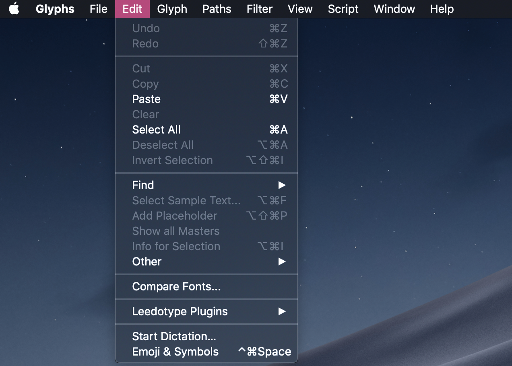

# LT-Toolkit-Manager

This is a toolkit license manager for the plugins made by [Leedotype](https://leedotype.com) for [Glyphs](https://glyphsapp.com)

## Install

You can install this plugin using Glyphs plugin manager.

After installing the plugin, you will see a new LT menu generated.

## Usage

1. [Register](#Register)
2. [License](#License)
3. [Login](#Login)
4. [Activation](#Activation)

### Register

You need a verified email to use plugins.

Visit [toolkit.leedotype.com](https://toolkit.leedotype.com/register) to join Leedotype.

A mail will be sent to the email address you have signed up with.

Click a link inside it to verify your email address.

### License

You don't have any license yet.

You can contact [Kang Hyunwoong](mailto://hyunwoong.kang@leedotype.com)(hyunwoong.kang@leedotype.com) to request for a license.

### Login

You can now log in to authenticate the plugins.

Click _LT->Login_ to open a login window.

### Activation

You can use your leedotype toolkit license at the same time in up to 2 devices.

When you login in a device for the first time, you will get prompted to activate your device.

LT-Toolkit-Manager internally uses [MAC Address](https://en.wikipedia.org/wiki/MAC_address) to identify your device.

Since it doesn't mean much for human eyes, set the nickname so that in case you want to deactivate an older device you can identify it.

## Use your plugins

Congrats!

You can now use your LT-plugins now!

- [Hangul Combination](https://github.com/hwoongkang/LT-Hangul-Combination)
- Component Manager(To be released)
